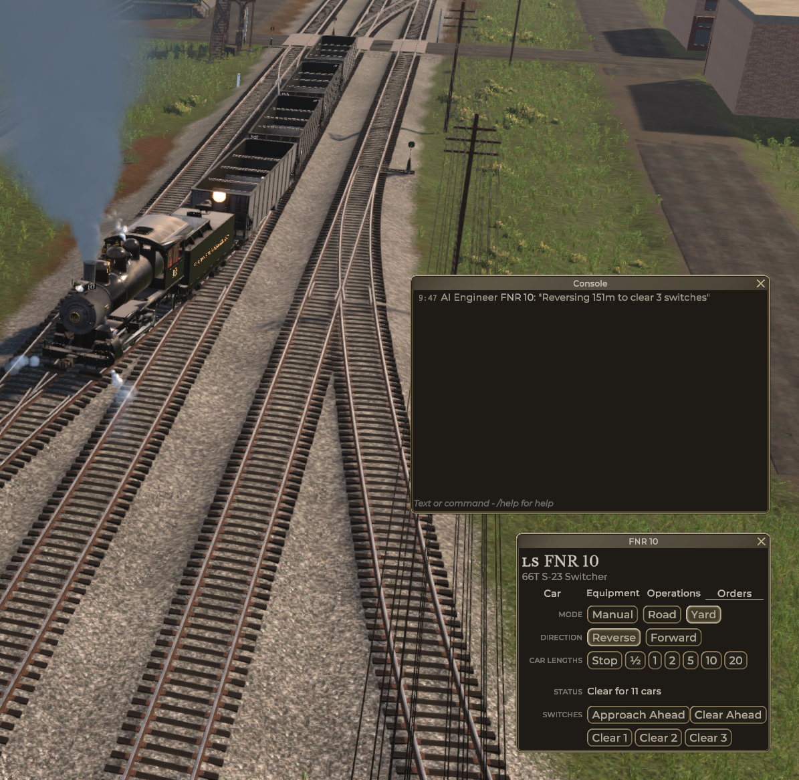

# Railroader Mod: SmartOrders

Make shunting easier by telling the AI where to move in relation to nearby switches.

This mod adds the following buttons to the Yard AI panel:

* **Approach Ahead**: AI will approach, but not pass the switch immediately ahead of the train in the direction of travel
* **Clear Ahead**: AI will pass the switch immediately ahead of the train, so the full length of the train is on the other side of the switch
* **1, 2, 3 etc**: Starting from the back of the train, the AI will look for switches under the train and move so it clears 1, 2 or 3, etc switches as desired. If there are not enough switches under the train, it will continue looking for switches ahead of the train

When approaching or clearing a switch, if the train stops on the _exit side_ of the switch, the AI will leave enough room for the other track to be used.

The AI will look for switches as far as 4000 feet away, but is less precise the further away the target switch is. If the track ends before it finds all the switches you asked for it will just move to the track end, using the existing Yard AI logic to do so safely. If it can't it can't find all the switches you asked for in the 4000 feet in front of the train, it will just move 4000 feet and stop.

Known incompatability: Unfortunately this mod is **not** compatible with wexp's [RR-YardAiExtended](https://github.com/wexp/RR-YardAiExtended) mod, however if you use SmartOrders and just ask the AI to move the train "10 switches" it has the same effect as "move the train really far".

Example usage:

You have a train stopped in Parson's Tannery P3 and need to get back to the mainline. There are seven switches between Parson's Tannery P3 and the mainline, so you press the **7** button and the AI magically brings the entire train back to the mainline stopping just beyond the last switch.

If you find this mod useful you might like **[FlyShuntUI](https://github.com/peterellisjones/Railroader-FlyShuntUI)** as well

## Installation

* Download `SmartOrders-VERSION.Railloader.zip` from the releases page
* Install with [Railloader]([https://www.nexusmods.com/site/mods/21](https://railroader.stelltis.ch/))

## Project Setup

In order to get going with this, follow the following steps:

1. Clone the repo
2. Copy the `Paths.user.example` to `Paths.user`, open the new `Paths.user` and set the `<GameDir>` to your game's directory.
3. Open the Solution
4. You're ready!

### During Development
Make sure you're using the _Debug_ configuration. Every time you build your project, the files will be copied to your Mods folder and you can immediately start the game to test it.

### Publishing
Make sure you're using the _Release_ configuration. The build pipeline will then automatically do a few things:

1. Makes sure it's a proper release build without debug symbols
1. Replaces `$(AssemblyVersion)` in the `Definition.json` with the actual assembly version.
1. Copies all build outputs into a zip file inside `bin` with a ready-to-extract structure inside, named like the project they belonged to and the version of it.
